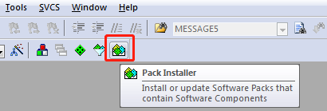
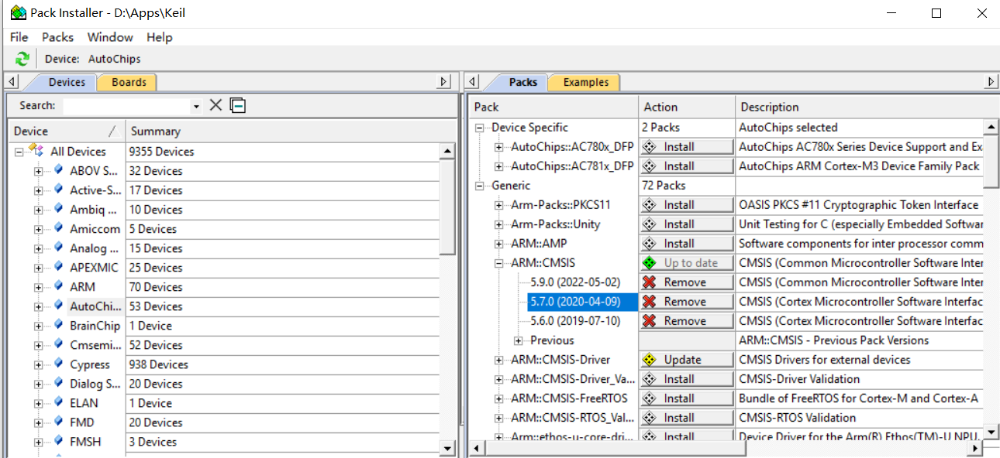
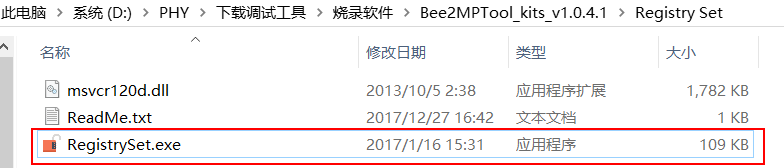
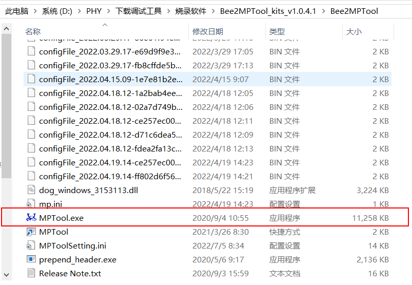
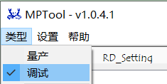
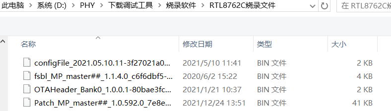
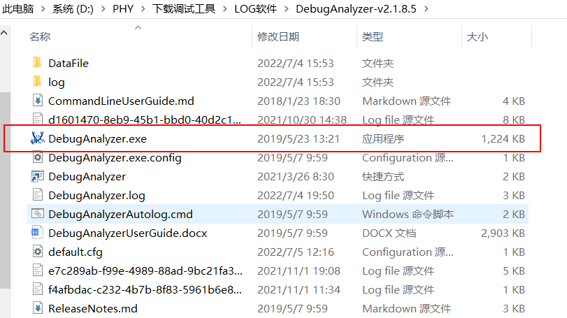
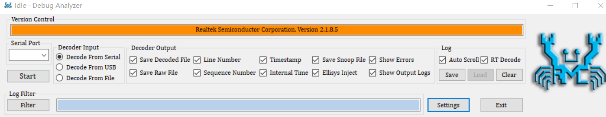
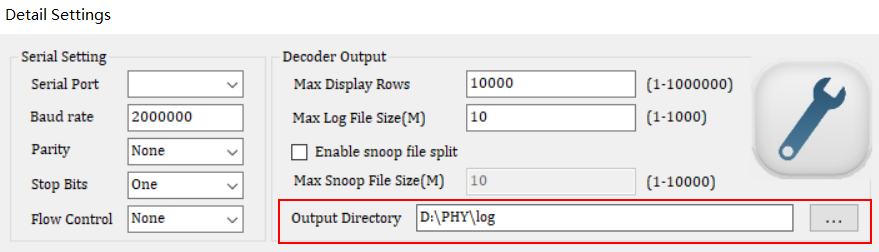

## 开发环境及工具

以下是在开发过程中需要搭建的环境及软件

1.搭建Linux开发环境

2.Keil MDK-Arm v5.29

3.Visual Studio Code

4.MPTool

5.Debug Analyzer

### 一、搭建Linux开发环境

#### （1）安装WSL

1.启用或关闭Windows功能首先在搜索栏中搜索并打开“启用或关闭Windows功能”，勾选“适用于Linux的Windows子系统”项。只有开启这项设置才能正常安装WSL;

2.安装 WSLhttps://docs.microsoft.com/en-us/windows/wsl/install-manual
在微软应用商店搜索 Linux，可以看到一系列 Linux 发行版，根据自己需要选择适合自己的发行版，这里我选用 Ubuntu 20 LTS，下载完成后启动，等待安装完成，输入账户和密码，我们便得到了一个 Linux 环境了

3.WSL 文件位置
如果想在 Linux 查看其他分区，WSL 将其它盘符挂载在 /mnt 下

#### （2）安装Telink GCC编译器

1. 复制tc32_gcc_v2.0.tar.bz2到HOME目录   （也可直接用鼠标复制过去）
   如"tc32_gcc_v2.0.tar.bz2"所在目录为"D:\Telink\tc32_gcc_v2.0.tar.bz2",执行命令:
   cp /mnt/D/Telink/tc32_gcc_v2.0.tar.bz2 ~/

C:\Users\141302\Desktop
2. 解压并安装到/opt目录

    sudo apt-get install tar

    sudo tar -xvjf tc32_gcc_v2.0.tar.bz2 -C /opt/

3. 添加路径到PAHT,为了避免每次重启都都要重设路径,可以将此行加入.bashrc
   export PATH=$PATH:/opt/tc32/bin
4. 测试是否搭建成功
   tc32-elf-gcc -v

   如果搭建成功将打印如下信息:

   Using built-in specs.
   COLLECT_GCC=tc32-elf-gcc
   COLLECT_LTO_WRAPPER=/opt/tc32/lib/gcc/tc32-elf/4.5.1.tc32-elf-1.5/lto-wrapper
   Target: tc32-elf
   Configured with: ../../gcc-4.5.1/configure --program-prefix=tc32-elf- --target=tc32-elf --prefix=/opt/tc32 --enable-languages=c --libexecdir=/opt/tc32/lib --with-gnu-as --with-gnu-ld --without-headers --disable-decimal-float --disable-nls --disable-mathvec --with-pkgversion='Telink TC32 version 2.0 build' --without-docdir --without-fp --without-tls --disable-shared --disable-threads --disable-libffi --disable-libquadmath --disable-libstdcxx-pch --disable-libmudflap --disable-libgomp --disable-libssp -v --without-docdir --enable-soft-float --with-newlib --with-gcc --with-gnu- --with-gmp=/opt/tc32/addontools --with-mpc=/opt/tc32/addontools --with-mpfr=/opt/tc32/addontools
   Thread model: single
   gcc version 4.5.1.tc32-elf-1.5 (Telink TC32 version 2.0 build)

#### （3）安装make

    sudo apt-get install make

### 二、Keil

#### （1）下载Keil安装文件

    打开Keil官网https://www.keil.com，进入页面后点击 Download 到下载页面，选择 Product Downloads 点击进入，选择MDK-Arm，填写信息后即可进行下载；

#### （2）安装Keil

右键点击刚才下载好的安装文件，以管理员身份运行，勾选同意，填写信息，选择安装路径，进行安装，安装完成后点击finish即可。

#### （3）导入Keil包

打开Pack Installer

导入包

### 三、Visual Studio Code

    VSCode 作为代码编译运行平台，VSCode的安装见官方文档：https://code.visualstudio.com/docs

### 四、MPTool

MPTool用于烧录

#### （1）运行RegistrySet.exe

#### （2）安装MPTool

#### （3）设置MPTool

  1.类型选择"调试"；

2.文件类型添加4个bin文件；

### 五、Debug Analyzer

Debug Analyzer用于打印log

#### （1）安装Debug Analyzer

#### （2）设置输出路径

